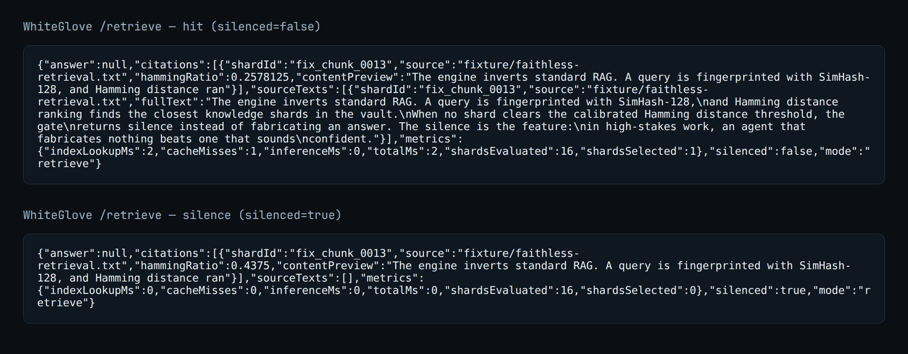

## WhiteGlove — source-only, silence-first private retrieval

Answers only when it can cite the exact source; otherwise stays silent. Built for high‑risk data like medical and legal.



### What this repo contains
- A SimHash‑128 retrieval pipeline that returns source text and citations, not guesses.
- A small HTTP API you can run locally.
- A fixture “finish line” so the retrieval path can be verified on a fresh clone.
- Related subsystems for trust and ops (kept separate from the core retrieve path).

Link: the terrain/runway comes from the public repo `spectral-terrain` (`https://github.com/Metatronsdoob369/spectral-terrain`), which turns code into 3D environments agents can move through.

## How it works
- Faith‑Less retrieve (no generation): `brain/landmark-orchestrator.ts`
  - Queries and shards are signed with SimHash‑128 using IDF‑weighted, code‑aware tokenization. See `brain/indexer/simhash-guard.ts`.
  - Rank by Hamming distance and apply a calibrated gate (`queryThreshold`, default 0.325). If nothing clears the gate, return silence with the closest miss. If matches exist, return the verified source text and citations. See `retrieve()` and the `QueryResult` shape.
  - Hot ring buffer and LFU cache improve locality without changing correctness.
- Optional synthesis: `query()` in `landmark-orchestrator.ts` calls a local Ollama model if available. Retrieval still runs first; silence wins if the gate fails.
- HTTP surface: `server/api.ts`
  - GET `/retrieve?q=...` returns the pure retrieval result (no LLM).
  - POST `/query` runs the agent loop (`agent/loop/agent-loop.ts`) with the same silence‑first policy.
- Fixture finish line: `finalize-mvp.sh`
  - `WG_CORPUS=fixture WG_VERIFY=1` builds paragraph‑sized shards from the committed fixture corpus, restores/builds the index, boots the API, smoke‑tests `/health`, `/payload/:sector`, and `/retrieve`, then writes `dist/WHITEGLOVE_SYSTEM_DIRECTIVE_*.json` and `dist/manifest.json`. No commits in verify mode.

Only subsystems that matter for the retrieval story are mentioned below. Others are kept minimal here for clarity.

## Stack
- Node.js + TypeScript (`ts-node`, `typescript`)
- Retrieval and API: local filesystem shards, SimHash‑128 (BigInt), Hamming distance
- Optional local inference: Ollama HTTP API (no cloud dependency)
- Tooling present in the repo:
  - Qdrant REST client (`@qdrant/js-client-rest`) used by the legal spectral pipeline harness
  - Shell and Python utilities under `brain/spectral/` for offline artifact/publisher flows

## Quickstart (local)
1) Install

```bash
npm install
```

2) Verify the fixture finish line (builds a small vault, boots the API, runs smoke checks, writes artifacts)

```bash
npm run finishline:verify
```

3) Run the retrieval API in dev

```bash
PORT=4880 npm run dev
# Pure retrieval
curl "http://localhost:4880/retrieve?q=the+engine+inverts+standard+rag"
# Agent loop (same silence-first policy)
curl -X POST "http://localhost:4880/query" \
  -H "Content-Type: application/json" \
  -d '{"query":"your question","sector":"general"}'
```

4) Run tests

```bash
npm run test              # regression + retrieval
npm run test:retrieval    # SimHash/silence contract
```

## Files that matter
- Retrieval engine: `brain/landmark-orchestrator.ts`
- SimHash guard + IDF weighting: `brain/indexer/simhash-guard.ts`
- HTTP API: `server/api.ts`
- Fixture vault builder: `brain/indexer/build-fixture-vault.ts`
- Finish line script: `finalize-mvp.sh`
- Retrieval contract test: `tests/retrieval/test_retrieval_contract.ts`

## Related subsystems (kept separate)
- x402 service and witness log: `spectral-x402/` contains a paid‑surface harness with a verifiable witness chain and an MCP server. It is covered by tests (see `spectral-x402/src/test/*.ts`). Not required to run retrieval.
- Spectral config/manifests: `spectral-config/` contains code‑to‑manifest tooling used by the terrain pipeline.
- Local ops harness: `brain/spectral/pipeline_run.sh` and companions provide a Qdrant‑compatible publisher and integrity checks for legal spectral artifacts. Used by `tests/regression/test_pipeline.sh`.

## Design constraints
- Source‑only answers. If no shard clears the calibrated gate, the agent stays silent.
- Offline by default. Retrieval uses the local index and shard files.
- No compliance claims. This is designed for high‑risk data, but it makes no certification claims.

## Notes for reviewers
- The retrieve path is implemented in `retrieve()` and exercised by `tests/retrieval/test_retrieval_contract.ts`.
- Endpoints are defined in `server/api.ts` and are hit by `finalize-mvp.sh` during the finish‑line run.
- The default retrieval threshold (0.325) and IDF‑weighted tokenization are set in code; recalibration per corpus is supported.
